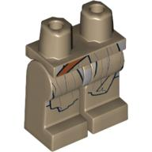
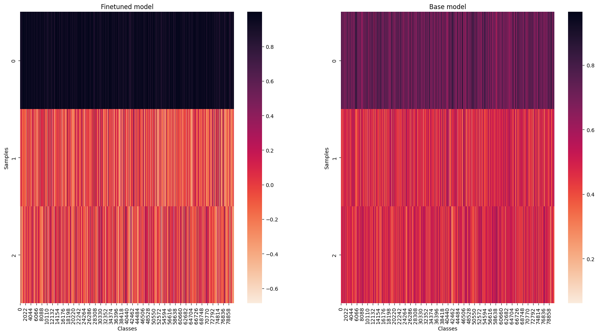
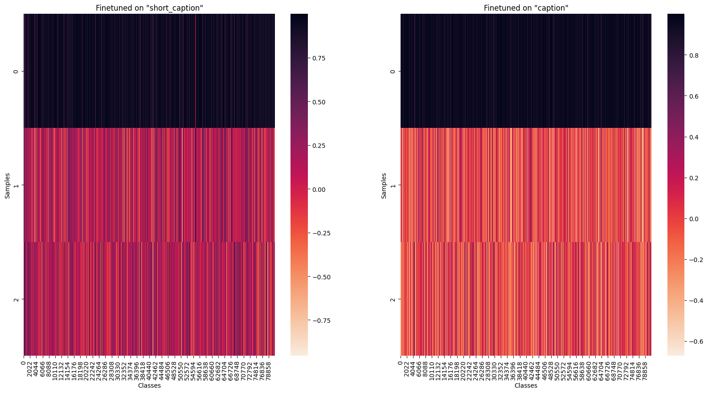

# Model Card for clip-vit-base-patch32_lego-brick

## Model Details

This model is a finetuned version of the `openai/clip-vit-base-patch32` CLIP (Contrastive Language-Image Pretraining) model on the [`lego_brick_captions`](https://huggingface.co/datasets/Armaggheddon/lego_brick_captions), specialized for matching images of Lego bricks with their corresponding textual description.

> [!NOTE] 
> If you are interested on the code used refer to the finetuning script on my [GitHub](https://github.com/Armaggheddon/BricksFinder/blob/main/model_finetuning/src/finetune.py)


## 🔍 Discover the Power of This Model
Ever struggled to figure out the name of that one elusive LEGO brick? Or maybe you’ve got a vague idea or a picture, but the exact part number’s a mystery? That’s where [BricksFinder](https://github.com/Armaggheddon/BricksFinder) comes in!

Drop in a description like "blue curved slope" or upload an image of the piece, and our model will work its magic to find the closest matches. It’ll show you a list of images with bricks that look just like the one you’re thinking about—or maybe even better!


Perfect for LEGO enthusiasts, builders, or anyone who loves a good ol’ treasure hunt among bricks. Check out the live demo on Colab and give it a try!<a target="_blank" href="https://colab.research.google.com/github/Armaggheddon/BricksFinder/blob/main/live_demo/live_demo.ipynb">
  
</a>


## Model Description

- **Developed by:** The base model has been developed by OpenAI and the finetuned model has been developed by me, [Armaggheddon](https://huggingface.co/Armaggheddon).
- **Model type:** The model is a CLIP (Contrastive Language-Image Pretraining) model.
- **Language:** The model is expects English text as input.
- **License:** The model is licensed under the MIT license.
- **Finetuned from model clip-vit-base-patch32:** The model is a finetuned version of the `openai/clip-vit-base-patch32` model on the `lego_brick_captions` dataset. The model has been finetuned for 7 epochs on a 80-20 train-validation split of the dataset. For more details on the finetune script take a look at the code on my [GitHub](https://github.com/Armaggheddon/BricksFinder/blob/main/model_finetuning/src/finetune.py).

## Usage with 🤗 transformers
- Load the model and processor using the following code snippet:
    ```python
    import torch
    from transformers import CLIPProcessor, CLIPModel

    device = "cuda" if torch.cuda.is_available() else "cpu"

    model = CLIPModel.from_pretrained("Armaggheddon/clip-vit-base-patch32_lego-brick", device_map="auto").to(device)
    processor = CLIPProcessor.from_pretrained("Armaggheddon/clip-vit-base-patch32_lego-brick", device_map="auto").to(device)
    ```
- Using `Auto` classes:
    ```python
    from transformers import AutoModelForZeroShotImageClassification, AutoProcessor

    model = AutoModelForZeroShotImageClassification.from_pretrained("Armaggheddon/clip-vit-base-patch32_lego-brick")
    processor = AutoProcessor.from_pretrained("Armaggheddon/clip-vit-base-patch32_lego-brick")
    ```
- Using with `pipeline`:
    ```python
    from transformers import pipeline

    model = "Armaggheddon/clip-vit-base-patch32_lego-brick"
    clip_classifier = pipeline("zero-shot-image-classification", model=model)
    ```

## Load in float16 precision

The provided model is in float32 precision. To load the model in float16 precision to speed up inference, you can use the following code snippet:
```python
from transformers import CLIPProcessor, CLIPModel

model = CLIPModel.from_pretrained("Armaggheddon/clip-vit-base-patch32_lego-brick", dtype=torch.float16)
processor = CLIPProcessor.from_pretrained("Armaggheddon/clip-vit-base-patch32_lego-brick")
```

or alternatively using `torch` directly with:
```python
import torch
from transformers import CLIPModel

model = CLIPModel.from_pretrained("Armaggheddon/clip-vit-base-patch32_lego-brick")
model_fp16 = model.to(torch.float16)
```

## Use cases

### Generating embedding
- To embed only the text:
    ```python
    import torch
    from transformers import CLIPTokenizerFast, CLIPModel

    device = "cuda" if torch.cuda.is_available() else "cpu"

    model = CLIPModel.from_pretrained("Armaggheddon/clip-vit-base-patch32_lego-brick", device_map="auto").to(device)
    tokenizer = CLIPTokenizerFast.from_pretrained("Armaggheddon/clip-vit-base-patch32_lego-brick")

    text = ["a photo of a lego brick"]
    tokens = tokenizer(text, return_tensors="pt", padding=True).to(device)
    outputs = model.get_text_features(**tokens) 
    ```
- To embed only the image:
    ```python
    import torch
    from PIL import Image
    from transformers import CLIPProcessor, CLIPModel

    device = "cuda" if torch.cuda.is_available() else "cpu"

    model = CLIPModel.from_pretrained("Armaggheddon/clip-vit-base-patch32_lego-brick", device_map="auto").to(device)
    processor = CLIPProcessor.from_pretrained("Armaggheddon/clip-vit-base-patch32_lego-brick", device_map="auto").to(device)

    image = Image.open("path_to_image.jpg")
    inputs = processor(images=image, return_tensors="pt").to(device)
    outputs = model.get_image_features(**inputs)
    ```

### Zero-shot image classification
```python
import torch
from PIL import Image
from transformers import CLIPProcessor, CLIPModel
from datasets import load_dataset

device = "cuda" if torch.cuda.is_available() else "cpu"

model = CLIPModel.from_pretrained("Armaggheddon/clip-vit-base-patch32_lego-brick", device_map="auto").to(device)
processor = CLIPProcessor.from_pretrained("Armaggheddon/clip-vit-base-patch32_lego-brick", device_map="auto").to(device)

dataset = load_dataset("Armaggheddon/lego_brick_captions", split="test")

captions = [
    "a photo of a lego brick with a 2x2 plate",
    "a photo of gray minifigure legs",
    "a photo of a brick with a curved slope",
]
image = dataset[0]["image"]

inputs = processor(text=captions, images=image, return_tensors="pt", padding=True).to(device)
outputs = model(**inputs)

logits_per_image = outputs.logits_per_image
probabilities = logits_per_image.softmax(dim=1)
max_prob_idx = torch.argmax(logits_per_image, dim=1)
```

## Results
The goal was to obtain a model that could more accurately distinguish brick images based on their textual description. On this regard, in terms of accuracy, both models perform similarly. However, when testing on a classification task, with the code in the [Zero-shot image classification](#zero-shot-image-classification) section, the finetuned model is able to more accurately classify the images with a much greater level of confidence. For example when testing the model with the following inputs: 
- `A sand green 2x2 minifigure legs piece with two axle holes on top.  The legs feature a printed design depicting wrapped fabric, in shades of light grey, orange, and beige.  The piece is solid and has no additional connection points besides the axle holes.`
- `A medium-green 1x1 round minifigure head features a printed design:  two yellow eyes, pink floral elements, and a toothy grin.  It has a standard top stud for attachment,  and no other connection points are visible. The printed details are detailed and cover a majority of the surface.`
- `A white 2x2 brick with four studs, each imprinted with the LEGO logo.  The brick is a standard 2x2 size, with no additional holes or features.  The color is a bright, slightly off-white`

and using as input image the following:



The finetuned model outputs:
- **100.00%**: "A sand green 2x2 minifigure legs piece with two axle holes on top.  The legs feature a printed design depicting wrapped fabric, in shades of light grey, orange, and beige.  The piece is solid and has no additional connection points besides the axle holes."
- **0.00%**: "A medium-green 1x1 round minifigure head features a printed design:  two yellow eyes, pink floral elements, and a toothy grin.  It has a standard top stud for attachment,  and no other connection points are visible. The printed details are detailed and cover a majority of the surface."
- **0.00%**: "A white 2x2 brick with four studs, each imprinted with the LEGO logo.  The brick is a standard 2x2 size, with no additional holes or features.  The color is a bright, slightly off-white"

while the base model for the same inputs gives:
- **98.7%**: "A sand green 2x2 minifigure legs piece with two axle holes on top.  The legs feature a printed design depicting wrapped fabric, in shades of light grey, orange, and beige.  The piece is solid and has no additional connection points besides the axle holes."
- **1.24%**: "A medium-green 1x1 round minifigure head features a printed design:  two yellow eyes, pink floral elements, and a toothy grin.  It has a standard top stud for attachment,  and no other connection points are visible. The printed details are detailed and cover a majority of the surface."
- **0.00%**: "A white 2x2 brick with four studs, each imprinted with the LEGO logo.  The brick is a standard 2x2 size, with no additional holes or features.  The color is a bright, slightly off-white"

That shows how the finetuned model is able to classify the images based on their textual description accurately. However, the base model is also able to classify the images correctly, with a marginally lower confidence.

Running the same task across the whole dataset with 1 correct caption (always the first) and 2 randomly sampled ones, results in the following metrics:


The plot visualizes the **normalized text logits** produced by the finetuned and base models:
- **Input:** For each sample, an image of a Lego brick was taken, along three captions:
    - The **correct caption** that matches the image (in position 0).
    - Two **randomly sampled, incorrect captions** (in position 1 and 2).
- **Output:** The model generated text logits for each of the captions, reflecting similarity between the image embedding and each caption embedding. These logits were then normalized for easier visualization.
- **Heatmap Visualization:** The normalized logits are displayed as a heatmap where:
    - Each **row** represents a different input sample
    - Each **column** represents one of the three captions: the correct one (0, first row), and two of the random ones (1 and 2, second and third rows) for a given sample image.
    - The **color intensity** represents the normalized logit score assigned to each caption by the model, with darker colors indicating higher scores and this confidence (i.e. the larger the contrast between the first row with the second and third, the better the results).

The **base model** (right), as expected, did not show high confidence in any of the classes, showing poor discrimination capability for the image and text samples, also highligted by a much smaller variation between the scores for the labels. However, in terms of accuracy, it is still able to correctly assign the correct caption on 97.46% of the samples. 

The **finetuned model** (left) shows a much higher confidence in the correct caption, with a clear distinction between the correct and incorrect captions. This is reflected in the higher scores assigned to the correct caption, and the lower ones assigned to the incorrect captions. In terms of accuracy, the finetuned model shows similar results, but are slightly lower than the base model, with an accuracy of 99.23%.

## Finetune on `short_caption`
As an exercise, the model was also finetuned on the `short_caption` column of the dataset. And compared, using the same method as before to the base, finetuned on the `caption` column models. Using the same sample image with the labels from the `short_caption`, the results are as follows:

fine-tuned on `short_caption`:
- **100.00%**: " Hips and Dark Tan Legs with Robe and Dark Orange Strap Print"
- **0.00% (2.32e-21)**: " Minifig Head Slizer, Yellow Eyes, Pointed Teeth and Bubbles Print [Blocked Open Stud]"
- **0.00% (5.91e-18)**: "Brick 2 x 2 without Inside Ridges"

fine-tuned on `caption`:
- **100.00% (1)**: " Hips and Dark Tan Legs with Robe and Dark Orange Strap Print"
- **0.00% (3.38e-14)**: " Minifig Head Slizer, Yellow Eyes, Pointed Teeth and Bubbles Print [Blocked Open Stud]"
- **0.00% (2.9e-8)**: "Brick 2 x 2 without Inside Ridges"

base model:
- **0.00%**: " Hips and Dark Tan Legs with Robe and Dark Orange Strap Print"
- **22.07%**: " Minifig Head Slizer, Yellow Eyes, Pointed Teeth and Bubbles Print [Blocked Open Stud]"
- **77.79%**: "Brick 2 x 2 without Inside Ridges"

Inspite finetuning on the `short_caption` column, comparing the results to the one finetuned on the `caption` column, the results are quite similar. The only difference between the two is the higher span of the values between the correct one and the wrong ones. In this case the base model performs significantly worse than the case where the column `caption` was used for this classification while also assigning the wrong caption.


As for before, running the task across all the dataset selecting a correct and 2 random captions, the results are as follows:

Comparing the models finetuned on `short_caption` and `caption` yields the following results:

The accuracy of the model finetuned on the `short_caption` column is 99.99% while the one finetuned on the `caption` column is 98.48.
While being more accurate, the tradeoff between the two is the confidence in the correct caption. Since the model finetuned on the `caption` column also has knowledge of much more flexibility in the textual search due to a more comprehensice `caption` column, is the one that has been uploaded here. 

The base model performed similarly as before when looping through the entire dataset. The accuracy still yields ~97% overall accuracy. This also highlights how, the selected sample might have been an outlier for the base model, as it was able to correctly classify most of the other image-text pairs.
