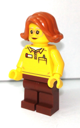
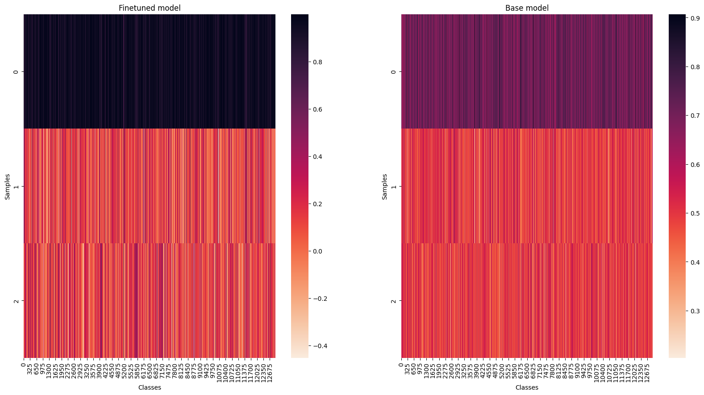

# Model Card for clip-vit-base-patch32_lego-minifigure

## Model Details

This model is a finetuned version of the `openai/clip-vit-base-patch32` CLIP (Contrastive Language-Image Pretraining) model on the [`lego_minifigure_captions`](https://huggingface.co/datasets/Armaggheddon/lego_minifigure_captions), specialized for matching images of Lego minifigures with their corresponding textual description.

> [!NOTE] 
> If you are interested on the code used refer to the finetuning script on my [GitHub](https://github.com/Armaggheddon/BricksFinder/blob/main/model_finetuning/src/finetune.py)


## 🤖 Minifigure Finder: Your LEGO Buddy Locator!

Got a minifigure in mind but can’t recall its name or where it came from? Maybe you’ve got a picture of your favorite little guy, but no clue how to describe it? Say no more, [BricksFinder](https://github.com/Armaggheddon/BricksFinder) has you covered!

Just type in something like "red shirt, pirate hat" or upload a photo of the minifigure, and voilà! You’ll get a list of matches with images of minifigs that fit your description. It’s like a LEGO buddy GPS but way cooler.


Whether you’re collecting, sorting, or just geeking out over LEGO, this tool’s here to help you connect with the minifigs you love. Try the live demo on Colab and see it in action! <a target="_blank" href="https://colab.research.google.com/github/Armaggheddon/BricksFinder/blob/main/live_demo/live_demo.ipynb">
  
</a>


## Model Description

- **Developed by:** The base model has been developed by OpenAI and the finetuned model has been developed by me, [Armaggheddon](https://huggingface.co/Armaggheddon).
- **Model type:** The model is a CLIP (Contrastive Language-Image Pretraining) model.
- **Language:** The model is expects English text as input.
- **License:** The model is licensed under the MIT license.
- **Finetuned from model clip-vit-base-patch32:** The model is a finetuned version of the `openai/clip-vit-base-patch32` model on the `lego_minifigure_captions` dataset. The model has been finetuned for 7 epochs on a 80-20 train-validation split of the dataset. For more details on the finetune script take a look at the code on my [GitHub](https://github.com/Armaggheddon/BricksFinder/blob/main/model_finetuning/src/finetune.py).

## Usage with 🤗 transformers
- Load the model and processor using the following code snippet:
    ```python
    import torch
    from transformers import CLIPProcessor, CLIPModel

    device = "cuda" if torch.cuda.is_available() else "cpu"

    model = CLIPModel.from_pretrained("Armaggheddon/clip-vit-base-patch32_lego-minifigure", device_map="auto").to(device)
    processor = CLIPProcessor.from_pretrained("Armaggheddon/clip-vit-base-patch32_lego-minifigure", device_map="auto").to(device)
    ```
- Using `Auto` classes:
    ```python
    from transformers import AutoModelForZeroShotImageClassification, AutoProcessor

    model = AutoModelForZeroShotImageClassification.from_pretrained("Armaggheddon/clip-vit-base-patch32_lego-minifigure")
    processor = AutoProcessor.from_pretrained("Armaggheddon/clip-vit-base-patch32_lego-minifigure")
    ```
- Using with `pipeline`:
    ```python
    from transformers import pipeline

    model = "Armaggheddon/clip-vit-base-patch32_lego-minifigure"
    clip_classifier = pipeline("zero-shot-image-classification", model=model)
    ```

## Load in float16 precision

The provided model is in float32 precision. To load the model in float16 precision to speed up inference, you can use the following code snippet:
```python
from transformers import CLIPProcessor, CLIPModel

model = CLIPModel.from_pretrained("Armaggheddon/clip-vit-base-patch32_lego-minifigure", dtype=torch.float16)
processor = CLIPProcessor.from_pretrained("Armaggheddon/clip-vit-base-patch32_lego-minifigure")
```

or alternatively using `torch` directly with:
```python
import torch
from transformers import CLIPModel

model = CLIPModel.from_pretrained("Armaggheddon/clip-vit-base-patch32_lego-minifigure")
model_fp16 = model.to(torch.float16)
```

## Use cases

### Generating embedding
- To embed only the text:
    ```python
    import torch
    from transformers import CLIPTokenizerFast, CLIPModel

    device = "cuda" if torch.cuda.is_available() else "cpu"

    model = CLIPModel.from_pretrained("Armaggheddon/clip-vit-base-patch32_lego-minifigure", device_map="auto").to(device)
    tokenizer = CLIPTokenizerFast.from_pretrained("Armaggheddon/clip-vit-base-patch32_lego-minifigure")

    text = ["a photo of a lego minifigure"]
    tokens = tokenizer(text, return_tensors="pt", padding=True).to(device)
    outputs = model.get_text_features(**tokens) 
    ```
- To embed only the image:
    ```python
    import torch
    from PIL import Image
    from transformers import CLIPProcessor, CLIPModel

    device = "cuda" if torch.cuda.is_available() else "cpu"

    model = CLIPModel.from_pretrained("Armaggheddon/clip-vit-base-patch32_lego-minifigure", device_map="auto").to(device)
    processor = CLIPProcessor.from_pretrained("Armaggheddon/clip-vit-base-patch32_lego-minifigure", device_map="auto").to(device)

    image = Image.open("path_to_image.jpg")
    inputs = processor(images=image, return_tensors="pt").to(device)
    outputs = model.get_image_features(**inputs)
    ```

### Zero-shot image classification
```python
import torch
from PIL import Image
from transformers import CLIPProcessor, CLIPModel
from datasets import load_dataset

device = "cuda" if torch.cuda.is_available() else "cpu"

model = CLIPModel.from_pretrained("Armaggheddon/clip-vit-base-patch32_lego-minifigure", device_map="auto").to(device)
processor = CLIPProcessor.from_pretrained("Armaggheddon/clip-vit-base-patch32_lego-minifigure", device_map="auto").to(device)

dataset = load_dataset("Armaggheddon/lego_minifigure_captions", split="test")

captions = [
    "a photo of a lego minifigure with a t-shirt with a pen holder",
    "a photo of a lego minifigure with green pants",
    "a photo of a lego minifigure with a red cap",
]
image = dataset[0]["image"]

inputs = processor(text=captions, images=image, return_tensors="pt", padding=True).to(device)
outputs = model(**inputs)

logits_per_image = outputs.logits_per_image
probabilities = logits_per_image.softmax(dim=1)
max_prob_idx = torch.argmax(logits_per_image, dim=1)
```

## Results
The goal was to obtain a model that could more accurately distinguish minifigure images based on their textual description. On this regard, in terms of accuracy, both models perform similarly. However, when testing on a classification task, with the code in the [Zero-shot image classification](#zero-shot-image-classification) section, the finetuned model is able to more accurately classify the images with a much greater level of confidence. For example when testing the model with the following inputs: 
- `a photo of a lego minifigure with a t-shirt with a pen holder`
- `a photo of a lego minifigure with green pants`
- `a photo of a lego minifigure with a red cap`

and using as input image the following:



The finetuned model outputs:
- **99.76%**: "a photo of a lego minifigure with a t-shirt with a pen holder"
- **0.10%**: "a photo of a lego minifigure with green pants"
- **0.13%**: "a photo of a lego minifigure with a red cap"

while the base model for the same inputs gives:
- **44.14%**: "a photo of a lego minifigure with a t-shirt with a pen holder"
- **24.36%**: "a photo of a lego minifigure with green pants"
- **31.50%**: "a photo of a lego minifigure with a red cap"

That shows how the finetuned model is able to more accurately classify the images based on their textual description.

Running the same task across the whole dataset with 1 correct caption (always the first) and 2 randomly sampled ones, results in the following metrics:


The plot visualizes the **normalized text logits** produced by the finetuned and base models:
- **Input:** For each sample, an image of a Lego minifigure was taken, along three captions:
    - The **correct caption** that matches the image (in position 0).
    - Two **randomly sampled, incorrect captions** (in position 1 and 2).
- **Output:** The model generated text logits for each of the captions, reflecting similarity between the image embedding and each caption embedding. These logits were then normalized for easier visualization.
- **Heatmap Visualization:** The normalized logits are displayed as a heatmap where:
    - Each **row** represents a different input sample
    - Each **column** represents one of the three captions: the correct one (0, first row), and two of the random ones (1 and 2, second and third rows) for a given sample image.
    - The **color intensity** represents the normalized logit score assigned to each caption by the model, with darker colors indicating higher scores and this confidence (i.e. the larger the contrast between the first row with the second and third, the better the results).

The **base model** (right), as expected, did not show high confidence in any of the classes, showing poor discrimination capability for the image and text samples, also highligted by a much smaller variation between the scores for the labels. However, in terms of accuracy, it is still able to correctly assign the correct caption on 99.98% of the samples. 

The **finetuned model** (left) shows a much higher confidence in the correct caption, with a clear distinction between the correct and incorrect captions. This is reflected in the higher scores assigned to the correct caption, and the lower ones assigned to the incorrect captions. In terms of accuracy, the finetuned model shows similar results, but are slightly lower than the base model, with an accuracy of 99.39%.
